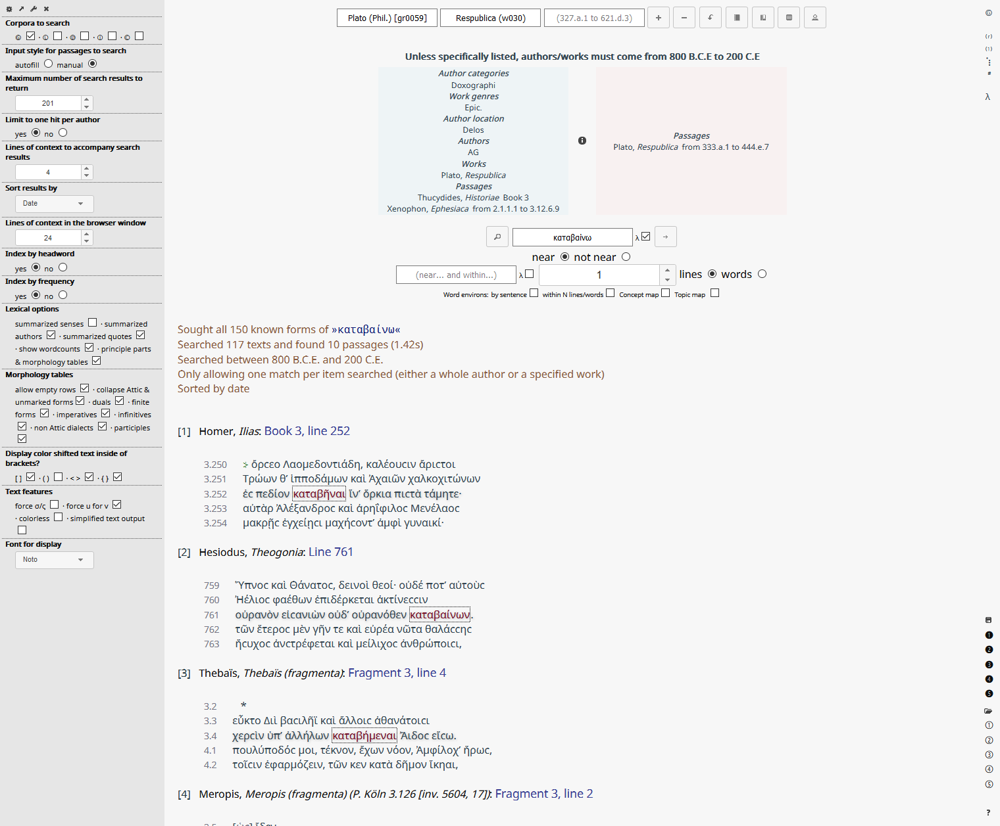
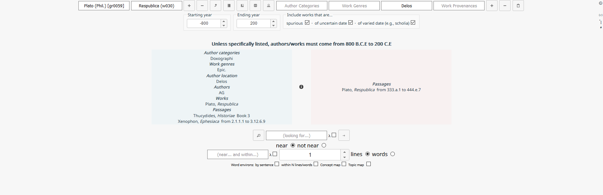
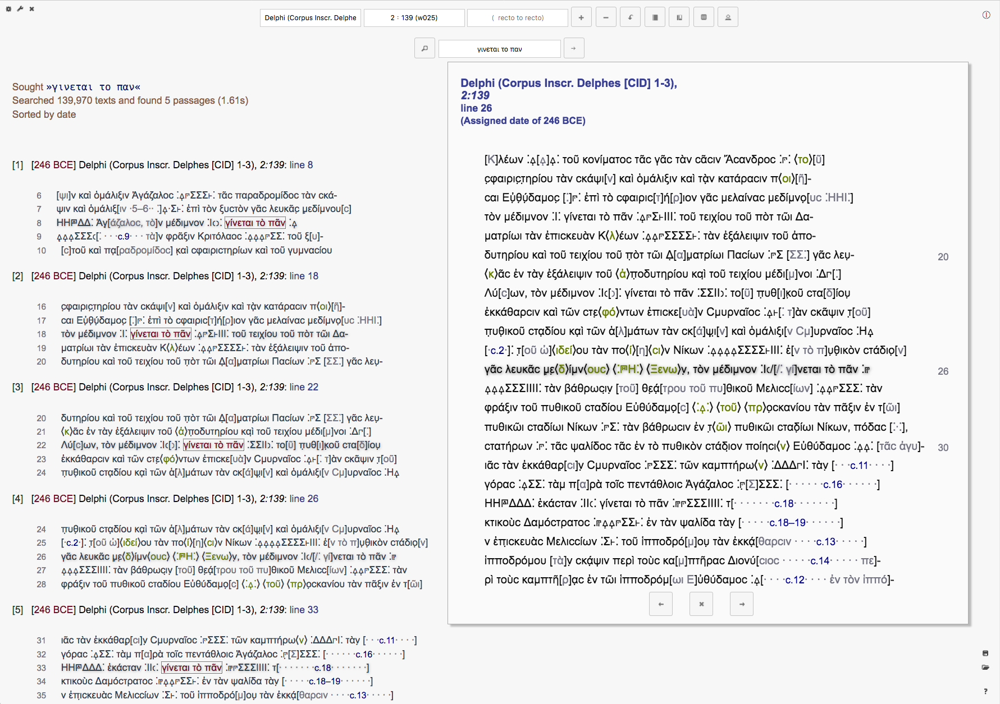
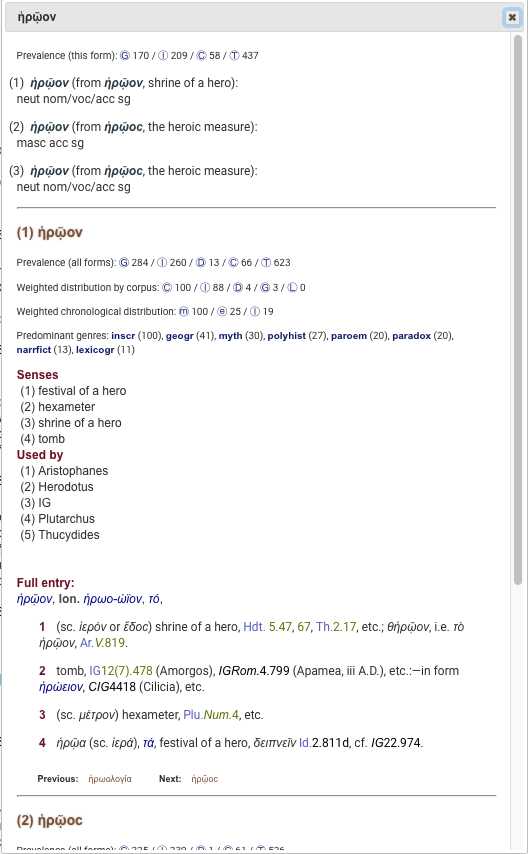
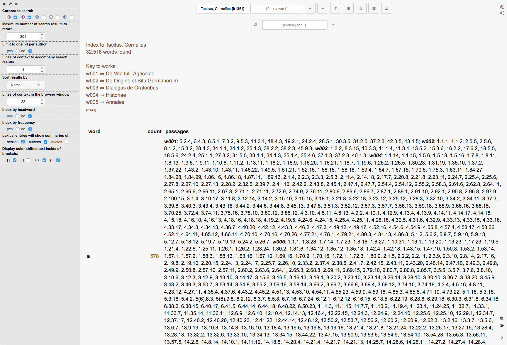
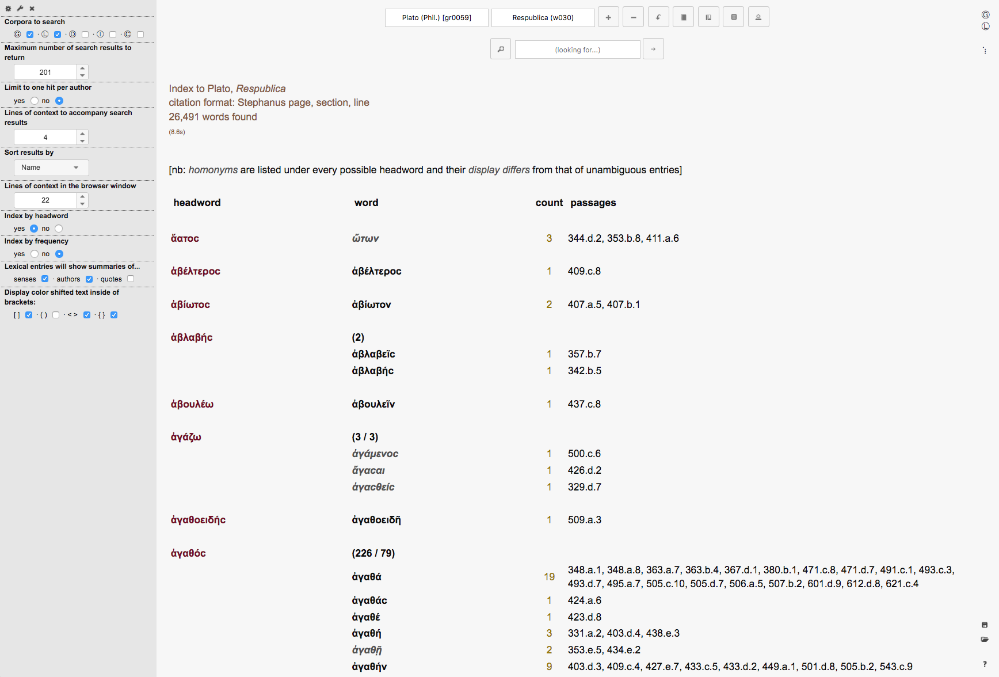
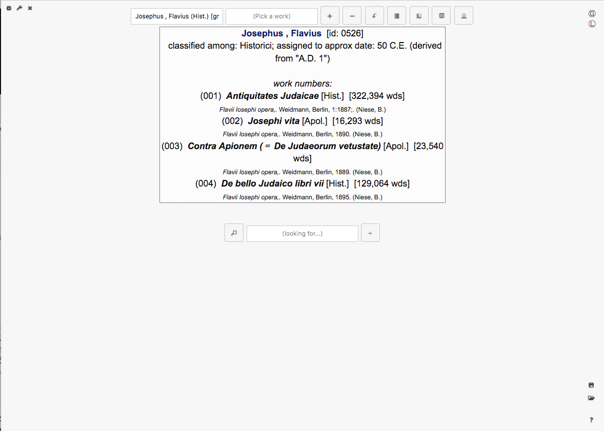
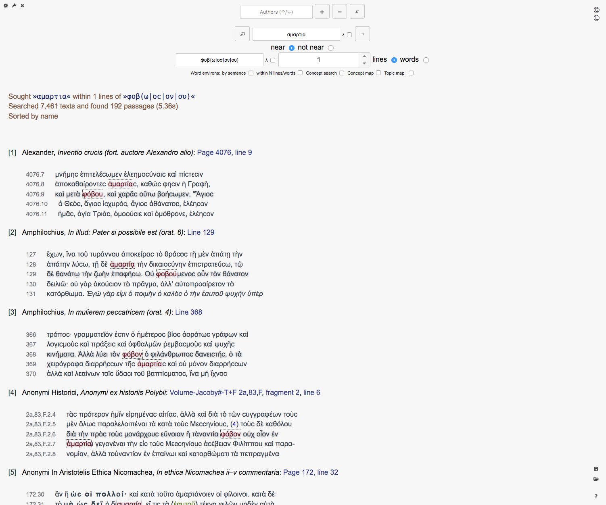
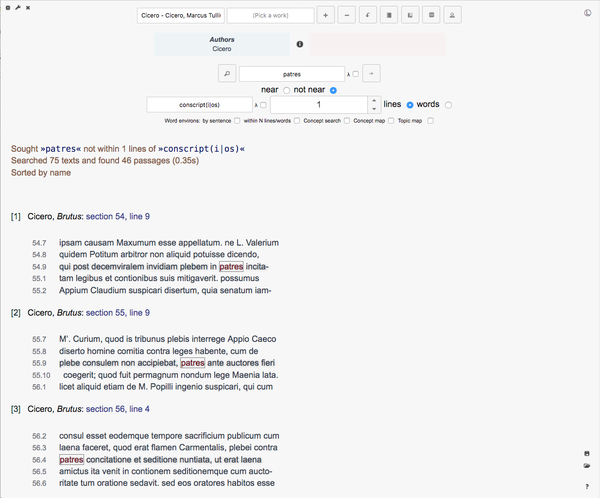
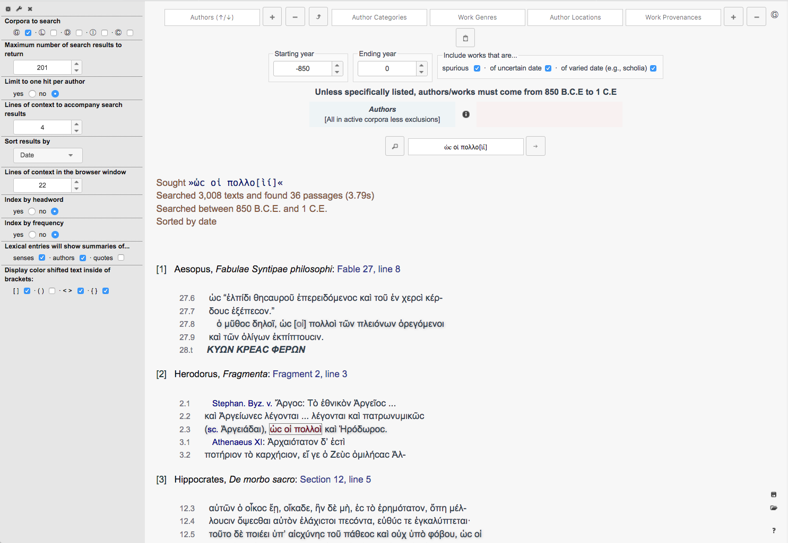

a front end to the database generated by HipparchiaBuilder

```
key features:
	searching
		search multiple corpora simultaneously
		build search lists with according to a variety of criteria
		    search by date range
			add/exclude individual authors
			add/exclude individual author genres
			add/exclude individual works
			add/exclude individual work genres
			add/exclude individual passages
			add/exclude individual author locations
			add/exclude individual work provenances
			include/exclude spuria
			include/exclude undateable works
			remove items from the list by "dragging to trash"
			store and load search lists between sessions
			reset sessions to configurable defaults
		search syntax
			search with or without polytonic accents
    			type accented words to make the search sensitive to accents
    			type unaccented words and the search is not sensitive to accents
			wildcard searching via regular expressions
			phrase searching: "κατὰ τὸ ψήφιϲμα", etc.
			proximity searching:
				within N lines or words
				not within N lines or words
		results
			results can be limited to a maximum number of hits
			results can be limited to one hit per author/work
			results can be sorted by name, date, etc
			can set amount of context to accompany results
	tools
		browser
			browse to any passage of your choice
			browse to any passage that occurs as a search result
			skim forwards or backwards in the browser
			click on words to acquire parsing and dictionary info for them
		dictionaries
			look up individual words in Greek or Latin
			get a morphological analysis of a Greek or Latin word
			get per corpus counts of the use of the word and its derivatives
			get a weighted chronological distribution of the word's use: mostly 'early', etc.
			get a weighted distribution by top 5 genres: show if a word predominantly 'epic', etc.
			get a summary of uses, senses, and quotes
			reverse lookup: 'unexpected' returns ἀδευκήϲ, ἀδόκητοϲ, ἀδόξαϲτοϲ, ἀελπτία, ...
			    by default results return in order of word frequency
			click to browse to passages cited in the lexical entries ('often' works)
			flip forward/backwards through neighboring entries
		text maker
			build a text of a whole work or subsection of a work
			for example see Xenophon, Hellenica as a whole or just book 3 or just book 3, chapter 4
		index maker
			build an index for a whole author, work or subsection of a work
			for example see an index to all of Vergil or just the Aeneid or just Book 1 of the Aeneid
			index by word observed or by dictionary headword (if found...)
			sort index alphabetically or by number of hits
			click on index words to get lexical information [excessive index size will disable this]
			click on index passages to browse to that passage [excessive index size will disable this]

	local/contextual information
	    searches give progress updates in percentage complete and time elapsed
	    concordance builds give progress updates in percentage complete and time elapsed
	    search lists can be inspected/hidden before execution
	    local info on current author can be shown/hidden
	    local info on genre lists can be shown/hidden
	    show/hide the settings pane
	    show/hide the complex criteria setter
	    show/hide the complex search dialog boxes
	    hover over interface items to get tooltips

	misc
	    accepts betacode input of greek (with or without accents):
	        "MH=NIN A)/EIDE QEA\"
	        "mh=nin a)/eide qea\"
	        "mhnin aeide qea"
	    search will attempt to choose the most efficient strategy for any given situation
		text layout in results/browser/text maker sensitive to shifts in font face and size
	    text layout via CSS: possible to modify the style sheet to suit your own tastes
	    optional highlighting of editorial insertions: {abc}, <def>, (ghi), [jkl]
	    configurable defaults for most options
	    will display annotations to the original text
	    unicode support of technical, rare, and exotic characters (that you can also search for: 𐆂,𐄒, 🜚)
	    can find Coptic words and characters: 'ⲫⲓⲗⲟⲑⲉⲟⲥ', 'ϩανϭοϊ̈', etc.
	    forward-compatible unicode: attempt to properly code characters which are not yet available in most fonts
	    known unknowns: unhandled characters preserve their betacode messages in the metadata for future fixes


```

HipparchiaServer typically runs from the command line within a python virtual environment

for example:

    % ~/hipparchia_venv/bin/python3 ~/hipparchia_venv/HipparchiaServer/run.py

or, more tersely:

    % run.py

Upon startup you will eventually see:

    * Running on http://127.0.0.1:5000/ (Press CTRL+C to quit)

Then you aim your browser at http://localhost:5000 and you are ready to roll.

Alternately you can hook HipparchiaServer to something like nginx via uwsgi. That would create a different url

By default HipparchiaServer will not accept connections that do not originate from the host machine. It would be rather
unwise to expose this server to the whole internet. There are many elements to this unwisdom.

Let us only mention one of them: there are security checks inside Hipparchia, but many queries can be generated that would
consume vast computational resources. What would happen if 1000 people tried to do that to your machine at once?

Of course, most queries take <2s to execute. But servers live in the worst of all possible worlds.

Instructions on how to use Hipparchia can be found by clicking on the '?' button if you can make it to the front page.

```

minimum software requirements:

    to launch HipparchiaServer
        python 3.6
            pip
            flask
            psycopg2
            bs4
            websockets
        postgresql9.5

    to properly interact with HipparchiaServer via a browser
        jquery
        jquery-ui
        js-cookie
        dejavu fonts [strongly recommended, not a hard requirement]

    javascript must be enabled in the browser
    the browser must accept cookies if you wish to save searches

```

please see HipparchiaBSD about setting up python and postgresql9.

the project pages for the other dependencies:

jquery:
    http://jquery.com/download/

jquery-ui:
    http://jqueryui.com/download/

js-cookie:
    https://github.com/js-cookie/js-cookie/releases

dejavu fonts:
    https://github.com/dejavu-fonts/dejavu-fonts/releases

see HipparchiaBSD for details on how to acquire and to install these items.
[details in 00_FreeBSD_initial_setup.txt or 01_macOS_hipparchia_installation.txt]


What you will see:

1. interface overview


1. inclusions and exclusions


1. early epic anger less the iliad


1. by location and date


1. browser


1. simple text


1. click for dictionary lookup


1. index to author


1. index by headword


1. local author info


1. search list preview


1. proximity searching a


1. proximity searching b


1. proximity searching c


1. phrase searching


1. search by special character


1. runs of two letter words


1. one hit zero context


